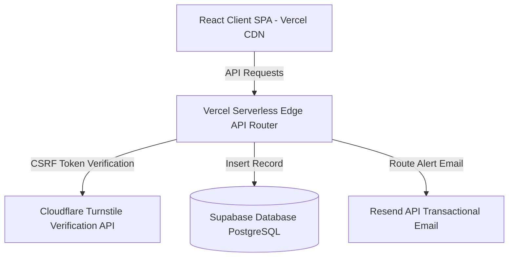
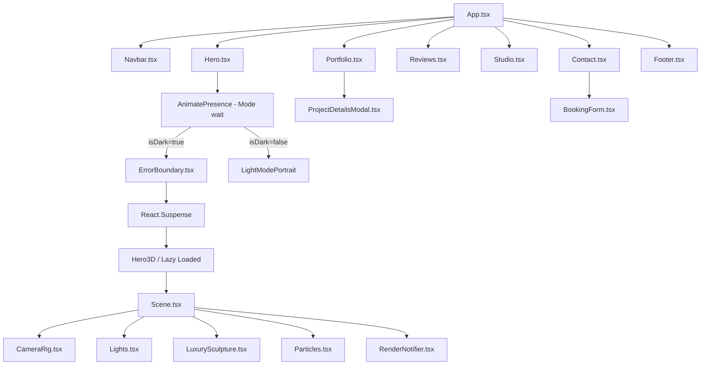
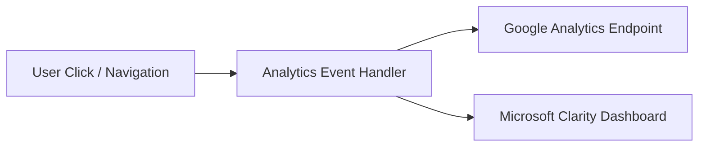
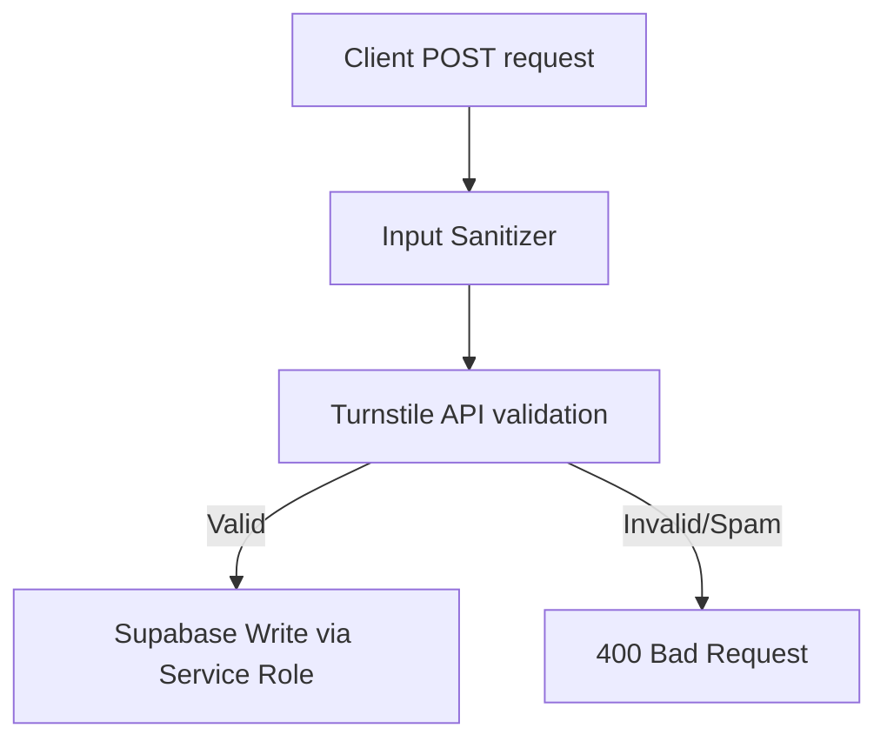

# Estique Designs Technical Architecture

This document outlines the technical architecture, component hierarchy, data flow, event tracking strategy, security boundaries, and build processes of the Estique Designs Portfolio Website.

---

## 🏗️ 1. Application Architecture

The project is structured as a modern Jamstack application combining a React 19 Single Page Application (SPA) frontend with serverless edge functions on the backend. 



---

## 🗂️ 2. Component Hierarchy

The components are nested as follows. Note that components containing expensive libraries (like Three.js) are code-split and lazy-loaded dynamically behind `<React.Suspense>`.



---

## 🔄 3. Data & Event Flows

### Event Flow (Google Analytics 4 & Microsoft Clarity)
The application fires event trackers for user actions. The tracking pipeline works asynchronously:



### Booking Funnel Pipeline
When a prospective client submits the inquiry form:
1. **Frontend Sanitization**: Fields are validated against regex checks (e.g. email patterns).
2. **Token Collection**: Cloudflare Turnstile token is generated on verification.
3. **Payload Dispatch**: Dispatched to `/api/booking` via POST request.
4. **Backend Edge Verification**: Cloudflare's server validates the Turnstile token.
5. **Database Archival**: The inquiry is written to the Supabase `bookings` table.
6. **Notification Routing**: An alert email is sent to Esther via the Resend API.
7. **Success Feedback**: The UI triggers the success screen, and the form state is reset.

---

## 🔑 4. Environment Variables & Credentials

The application utilizes two distinct layers of configuration parameters:

### Frontend Environment Variables (Pre-fixed with `VITE_`)
* **`VITE_SUPABASE_URL`**: Public endpoint link targeting the Supabase database.
* **`VITE_SUPABASE_ANON_KEY`**: Anonymous client access key.
* **`VITE_TURNSTILE_SITE_KEY`**: Cloudflare Turnstile public verification site key.

### Backend Serverless Keys (Secret Keys)
* **`SUPABASE_SERVICE_ROLE_KEY`**: Elevated Postgres credentials for backend database writes.
* **`RESEND_API_KEY`**: Authenticated token to dispatch transaction emails.
* **`TURNSTILE_SECRET_KEY`**: Private validation credential for Cloudflare verification.
* **`ESTHER_ALERT_EMAIL`**: Recipient address where project alerts are delivered.

---

## 🔒 5. Security Model



### Key Security Implementations:
1. **Input Sanitization**: Replaces dangerous HTML and script tags (`<`, `>`, `&`, `"`, `'`, `/`) with safe HTML entities before routing.
2. **Turnstile Checks**: Restricts API calls to users who have successfully solved the Cloudflare Turnstile puzzle.
3. **Service Role Security**: Restricts write access of bookings database records to authenticated backend sessions.

---

## 📦 6. Build & Deployment Architecture

### Compilation System (Vite 8 + Rolldown)
Vite handles bundling and asset compilation. Rolldown is configured to code-split dynamic imports:

```
dist/
├── index.html                   # Bootstrap page shell
└── assets/
    ├── index-[hash].css         # Compiled Tailwind css styles
    ├── index-[hash].js          # Core React client logic
    └── Hero3D-[hash].js         # Lazy-loaded WebGL rendering package
```

### Continuous Integration Pipeline (CI/CD)
* **Hosting Platform**: Vercel Serverless Hosting.
* **Branch Strategy**: Pushing commits to the `main` branch triggers an automatic production build and edge deployment.
* **Edge Routing**: Backend serverless routes are compiled and hosted on Vercel Edge Runtime for sub-millisecond execution times.
