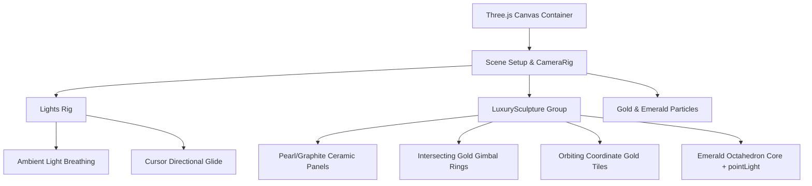
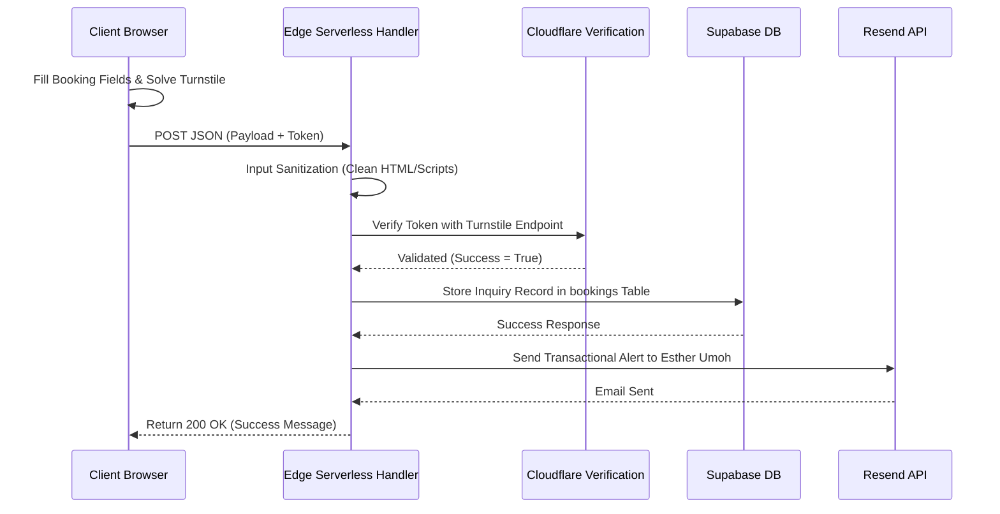

# Estique Designs Portfolio Project Documentation

Welcome to the comprehensive technical documentation for the Estique Designs Portfolio Website. This document serves as the single source of truth for the vision, design guidelines, engineering decisions, and implementation details of this high-end creative portfolio application.

---

## 🧭 1. Project Vision

### Business Objective
Estique Designs (led by Esther Umoh) is an elite creative studio specializing in bespoke brand logotypes, luxury book covers, and premium church media designs. The core objective of this website is to establish a digital showroom that converts high-value prospective clients into inquiries. Rather than relying on third-party design networks (like Behance or Dribbble), this website anchors the brand's identity, providing a custom space free of visual noise.

### Target Audience
* **Luxury Brand Owners**: High-end boutique entrepreneurs seeking signature monograms and clean corporate identity packages.
* **Independent & Traditional Authors**: Writers looking for publishing-ready, premium book cover layouts that command attention in physical retail and digital storefronts.
* **Ministries & Organizations**: Organizations requiring professional sermon branding, series graphics, and high-impact social announcements.

### Brand Positioning
Estique Designs represents **Timeless Sophistication, Restraint, and Craftsmanship**. The site's positioning stands between classical editorial aesthetics (fine lines, serif letterings) and modern interactive design (dynamic layout grids, WebGL graphics).

---

## 🎨 2. Design Philosophy

To elevate the user experience, we established five key pillars of design:
1. **Luxury & Restraint**: Avoid flashy colors or excessive visual noise. Emphasize gold-champagne tones (`#D4B895`), emerald accents (`#10b981`), graphite grids, and soft pearl backdrops.
2. **Minimalism**: Use layout elements only if they serve a distinct functional or structural purpose. White space is treated as an active design asset rather than empty canvas space.
3. **Editorial Typography**: A curated pairings system of **Cinzel** (for classical, luxury headings) and **Inter** (for high-legibility geometric content).
4. **Immersive WebGL Interactivity**: The 3D sculpture in the Hero section is not a flat asset or an isolated video; it is a live kinetic sculpture that responds dynamically to user mouse coordinates.
5. **Fluid Storytelling**: Transition states, case study modal slides, and category filters utilize cubic-bezier easing motions to mimic the physical pages of a premium gallery catalogue.

---

## 🛤️ 3. Development Journey

This case study traces the evolutionary history of the portfolio application through successive milestones:

### Milestone 1: The Initial Portfolio Redesign
The previous portfolio system relied on generic list pages and small thumbnails. We rebuilt the gallery grid to handle varied aspect ratios dynamically (portrait book covers alongside landscape church banners), establishing clean image borders and hover overlays.

### Milestone 2: Smart Category Filtering
Implemented a state-managed filter bar at the top of the showcase. To prevent page jumping, layout heights are locked dynamically, and grid items translate smoothly inside their flex columns.

### Milestone 3: Immersive Case Study Modals
Rebuilt project card interactions to slide open a dedicated case study modal. Each project details page contains structured context:
* **The Design Challenge (Problem)**
* **Creative Execution (Strategy & Solution)**
* **Strategic Business Result (Outcome)**
* **Creative Toolkit (Software tags)**
* **Pinterest Source Reference Link**

### Milestone 4: Three.js Hero Architecture Rebuild
The core interactive feature underwent multiple iterations to prevent WebGL Context Loss on mobile screens. We restructured the 3D scene:
* Deleted the over-engineered geometry loops.
* Code-split the Three.js library away from the initial bundle using lazy dynamic imports.
* Built a modular components folder under `src/components/Hero3D/` where files are strictly kept under 150 lines.

### Milestone 5: Secure Booking & Captcha Integration
To convert leads safely, we established an Edge API route (`api/booking.ts`) handling input sanitization, database archival via Supabase, and notification alerts via Resend SMTP routing. The endpoint validates a Cloudflare Turnstile token to verify real user interactions.

---

## 📂 4. Folder Structure & Components

```
PORTFOLIO/
├── api/
│   └── booking.ts             # Vercel Edge Serverless Function for inquiries
├── public/
│   └── portfolio/             # Curated client work image assets
├── src/
│   ├── assets/                # Logos and vector icons
│   ├── components/            # Frontend layout blocks
│   │   ├── Hero3D/            # WebGL interactive elements
│   │   │   ├── CameraRig.tsx  # Dynamic circular translations
│   │   │   ├── ErrorBoundary.tsx # WebGL failure handling
│   │   │   ├── Hero3D.tsx     # Loader/wrapper index exports
│   │   │   ├── Lights.tsx     # Directional key/rim glides & ambient breath
│   │   │   ├── LuxurySculpture.tsx # 3D cube mesh components
│   │   │   ├── Particles.tsx  # Dust system
│   │   │   ├── RenderNotifier.tsx # Swapchain load tracking
│   │   │   └── Scene.tsx      # Canvas layout and theme observer
│   │   ├── BookingForm.tsx    # Secure client booking inquiries
│   │   ├── Contact.tsx        # CTA contact block with WhatsApp trackers
│   │   ├── Footer.tsx         # Studio citation and page navigation links
│   │   ├── Hero.tsx           # Layout columns and SVG fallback layout
│   │   ├── Navbar.tsx         # Brand navigation and dark mode toggle
│   │   ├── PinterestShowcase.tsx # Live Pin inspiration grid
│   │   ├── Portfolio.tsx      # Filterable work collection
│   │   ├── ProjectDetailsModal.tsx # CASE STUDY overlay drawer
│   │   ├── Reviews.tsx        # Client testimonials
│   │   └── Studio.tsx         # Profile card introducing Esther Umoh
│   ├── data/
│   │   └── portfolio.ts       # Structured portfolio items data
│   ├── hooks/
│   │   └── useScrollLock.ts   # Scroll freeze helper during modal triggers
│   ├── index.css              # Custom Tailwind variables and anims
│   └── main.tsx               # Bootstrap configuration
```

### Component Responsibilities

#### `Navbar`
Manages global page navigation and handles theme-switching logic (appending `.dark` class to `document.documentElement` and saving preferences to localStorage).

#### `Hero`
Coordinates the split header layout. Renders headline/CTA content on the left, and the WebGL interactive canvas container on the right. Houses the static SVG fallback illustration when WebGL is unavailable.

#### `Hero3D` (Sub-folder)
Maintains the entire Three.js loop. Disposes of resources on unmount to prevent memory leaks and handles class-list mutations to toggle dark/light material roughness dynamically.

#### `Portfolio`
The central gallery. Filters the dynamic JSON database list and displays items in category columns. Emits event logs on user click.

#### `ProjectDetailsModal`
Triggered when a portfolio item is selected. Lock-freezes main page scrolling and mounts sticky detail grids with a list of tools and Pinterest links.

#### `BookingForm`
Coordinates client project inquiries. Collects service parameters, verifies inputs, triggers Cloudflare Turnstile, and posts JSON data to the backend edge handler.

---

## 🏎️ 5. State Management & Navigation

### Global State (Theme & Modals)
* **Theme State**: Simple, reactive class toggle on the document root element. Theme choices are stored in localStorage and read during initial layout injection to prevent screen flashes.
* **Modal Trigger State**: Lifted state in `App.tsx` handles active project item objects. When an object is active, `useScrollLock` modifies body styles to prevent background scroll drifting.

### Single Page Navigation (SPA Routing)
* Navigational links use smooth anchor scrolls targeting element IDs (`#portfolio`, `#booking`, `#studio`).
* Route changes are mapped as virtual page views in Google Analytics.

---

## ⚡ 6. Detailed 3D Scene Implementation (`Hero3D`)

The **Premium Kinetic Cube** represents the signature creative sculpture of Estique Designs.



### Geometry Components
* **Central Octahedron Core**: A faceted emerald gemstone core insert (`#10b981`).
* **Breathing Panels**: Six floating beveled boxes representing the cube faces. They animate outwards and inwards along their local axes over time.
* **Gimbal Rings**: Two intersecting champagne-gold rings rotating slowly at offsetting angles.
* **Orbiting Coordinate Tiles**: Small gold tiles drifting along a circular path to simulate coordinate indicators.

### Material Settings
* **Champagne Gold**: Brushed metallic texture. `metalness = 0.98`, `roughness = 0.22`.
* **Ceramic Core (Dark)**: `roughness = 0.38`, graphite color `#2C2C2C`.
* **Ceramic Core (Light)**: `roughness = 0.32`, pearl ivory color `#F7F5F0`.
* **Emerald Gemstone**: Translucent emissive material. `emissive = #10B981`, `emissiveIntensity = 1.2`.

### Light glide & Environment Breath (Interactive Highlights)
* The pointer position is tracked inside `useFrame` using `@react-three/fiber`'s `pointer` coordinates.
* The directional Key light (`#FFE9BD`) and Rim light (`#FFF7EB`) slide dynamically, dragging highlights across the gold rings.
* The ambient light intensity fluctuates slowly inside the loop (`Math.sin(state.clock.elapsedTime * 0.35) * 0.05`), simulating a dynamic studio spotlight environment.

### Theme-Specific Hero Experiences
To provide two complementary premium moods that reinforce the Estique Designs brand, the Hero right column automatically transitions its layout based on the active theme:
* **Dark Mode (WebGL 3D Showroom)**: Focuses on innovation and high-tech craft by rendering the interactive 3D Kinetic Cube sculpture (complete with gold/emerald dust particles, gimbal coordinates, and internal octahedron lighting).
* **Light Mode (Editorial Studio Portrait)**: Focuses on trust, personality, and human connection by rendering Esther's professional headshot as a luxury editorial photo showcase. It incorporates:
  * Background layers of warm champagne and soft emerald radial studio blurs.
  * A very subtle vertical floating transition.
  * Direct DOM cursor tracking parallax translations using Framer Motion's `useMotionValue` and `useSpring` hooks to prevent React state re-renders.
* **Seamless Cross-Fade Transition & Memory Cleanups**: Wrapped in an `<AnimatePresence mode="wait">` layout blocks. When a theme swap occurs, the outgoing experience fades out smoothly over 400ms before unmounting. The WebGL canvas is completely disposed of in Light Mode to save battery life, and the portrait DOM elements are unmounted in Dark Mode.

---

## 📊 7. Analytics & Edge Booking Flow

### Analytics Event Map
* `booking_form_opened`: Fired when a user selects "Book a Project".
* `booking_form_submitted`: Triggers when Turnstile verification begins.
* `booking_request_success`: Confirmed after database writing and email notifications finish.
* `booking_request_failed`: Logs validation or network exceptions.
* `whatsapp_link_clicked` & `email_link_clicked`: Tracks off-site communication links.

### The Booking Inquiry Process



---

## 🔒 8. Security & Performance

### Security Controls
* **No Client DB Tokens**: The frontend relies on Vercel Edge Serverless functions. Database keys (`SUPABASE_SERVICE_ROLE_KEY`) are kept secret on the server.
* **Strict CORS & Verification**: Booking requests require validation of the Turnstile token directly on Cloudflare server clusters.

### Performance Benchmarks
* **Code Splitting**: Dynamic imports divide Three.js dependencies into a separate lazy-loaded bundle.
* **Canvas Disposal**: Explicitly disposes of geometry, material shaders, and textures on canvas disposal.
* **DPR Capping**: Never exceeds DPR `1.5` to prevent hardware lag on low-end screens.

---

## ♿ 9. Accessibility & Fallbacks

* **Screen Readers**: Interactive buttons contain explicit `aria-label` descriptors.
* **Reduced Motion**: Swaps to a static theme-aware vector SVG layout when `prefers-reduced-motion: reduce` is detected.
* **Semantic Code**: Fully structural HTML5 formatting (`<section>`, `<article>`, `<header>`, `<footer>`).

---

## 🚀 10. Deployment Workflow

### Hosting Environment
* **Platform**: Vercel.
* **Database**: Supabase.
* **SMTP Provider**: Resend SMTP.
* **DNS Protection**: Cloudflare.

### Deployment Commands
```bash
# Production Build
npm run build
```
The output directory `dist/` is automatically synced and served globally via Vercel Edge CDN nodes.
