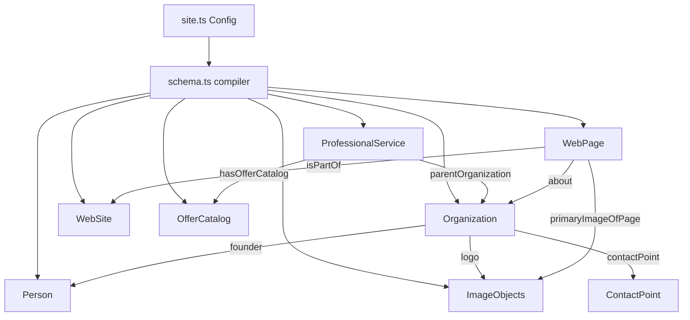

# 🎯 Schema.org Structured Data & Reusable SEO Framework
## DK Digital Studio Standard Architecture

This repository implements a production-grade, modular, and reusable Schema.org JSON-LD structured data framework. This serves as DK Digital Studio's standard SEO package for current and future client projects.

By separating business configurations from structured schema templates, developers can deploy this framework on a new website by updating a single configuration file without touching the underlying schema templates.

---

## 🗂️ 1. Folder Structure

The SEO and schema architecture is located in the following folders:

```
src/
 ├── config/
 │    └── site.ts           # ⚙️ Central Business & Branding Configuration
 ├── seo/
 │    ├── schema.ts         # 🔗 Core Linker Graph Compiler
 │    ├── organization.ts   # 🏢 Organization Schema Entity
 │    ├── person.ts         # 👩 Person (Founder & Occupation) Schema Entity
 │    ├── professionalService.ts # 🛠️ ProfessionalService Schema Entity
 │    ├── website.ts        # 🌐 WebSite Schema Entity
 │    ├── webpage.ts        # 📄 WebPage (Homepage context) Schema Entity
 │    ├── imageObject.ts    # 🖼️ ImageObject (Logo, OG, Portrait) Schema Entity
 │    ├── contactPoint.ts   # 📞 ContactPoint Schema Entity
 │    └── offerCatalog.ts   # 💼 OfferCatalog (Services Catalog) Schema Entity
 └── components/
      └── SchemaMarkup.tsx  # ⚛️ React Component Injector
```

---

## 🔄 2. Architecture & The Schema Graph Model

To satisfy Google Rich Results requirements and prevent data duplication, this framework compiles all entities into a single **Linked Graph** array (`@graph`) wrapped in a single JSON-LD block:



Every entity defines a unique `@id` URI (e.g. `https://estiquedesigns.com/#organization`). Other schemas reference these IDs to link founders, publishers, websites, and offers dynamically.

---

## 🚀 3. How to Deploy on a New Client Website

To reuse this architecture for another DK Digital Studio client (e.g. DamiGlow):

### Step 1: Update the Site Config
Open [src/config/site.ts](file:///c:/Users/InfinityMFB/Documents/PORTFOLIO/src/config/site.ts) and replace the values with the new client's metadata:

```typescript
export const siteConfig = {
  name: "DamiGlow",
  founder: {
    name: "Damilola Glowville",
    role: "Founder & Counsellor",
    occupation: "Counsellor & Content Creator",
    image: "https://damiglow.com/portrait.jpg",
    socials: ["https://youtube.com/c/damiglow"]
  },
  url: "https://damiglow.com",
  logoUrl: "https://damiglow.com/logo.png",
  ogImage: "https://damiglow.com/og-image.jpg",
  heroImage: "https://damiglow.com/hero.jpg",
  description: "DamiGlow is a relationship counselling and creative media studio...",
  email: "hello@damiglow.com",
  phone: "+234...",
  address: {
    country: "Nigeria",
    locality: "Lagos",
    region: "Lagos State"
  },
  socials: ["https://youtube.com/c/damiglow"],
  category: "Counselling Service",
  orgType: "Organization",
  language: "en-US",
  services: [
    {
      id: "service-counselling",
      name: "Marriage Counselling",
      description: "Professional certified relationship guidance..."
    }
  ]
};
```

That's it! All schema outputs, linked graphs, and dynamic Offers catalogs will automatically rebuild themselves using the new values.

---

## 🛠️ 4. How to Add Additional Schema Entities Later

If you need to expand the schema graph in the future (for example, adding an `FAQPage` or `BreadcrumbList`):

### Step 1: Create the Entity Builder
Create a new file in `src/seo/`, e.g., `src/seo/faq.ts`:

```typescript
import type { SiteConfig } from '../config/site';

export const getFaqSchema = (config: SiteConfig, faqs: { q: string, a: string }[]) => {
  return {
    "@type": "FAQPage",
    "@id": `${config.url}/#faq`,
    "mainEntity": faqs.map(faq => ({
      "@type": "Question",
      "name": faq.q,
      "acceptedAnswer": {
        "@type": "Answer",
        "text": faq.a
      }
    }))
  };
};
```

### Step 2: Append to the Graph Compiler
Open [src/seo/schema.ts](file:///c:/Users/InfinityMFB/Documents/PORTFOLIO/src/seo/schema.ts) and add the new builder:

```typescript
import { getFaqSchema } from './faq';

export const generateSchema = () => {
  const config = siteConfig;
  // ...
  const faq = getFaqSchema(config, [
    { q: "What is your timeline?", a: "Most projects take 2-4 weeks." }
  ]);

  return {
    "@context": "https://schema.org",
    "@graph": [
      organization,
      person,
      professionalService,
      website,
      webpage,
      ...images,
      catalog,
      faq // <-- Add FAQ to the compiled array!
    ]
  };
};
```

---

## 🔍 5. Verification & Testing

Verify validation status using Google's official testing utilities:

1. **Rich Results Validation**: Copy the compiled HTML snippet (or page URL) into the [Google Rich Results Test](https://search.google.com/test/rich-results). It will confirm parsing of `Organization`, `Person`, `ProfessionalService`, `WebSite`, and `WebPage`.
2. **Schema Markup Validation**: Paste your raw JSON-LD output directly into the [Schema Markup Validator](https://validator.schema.org) to check for syntax structure or warning flags.
