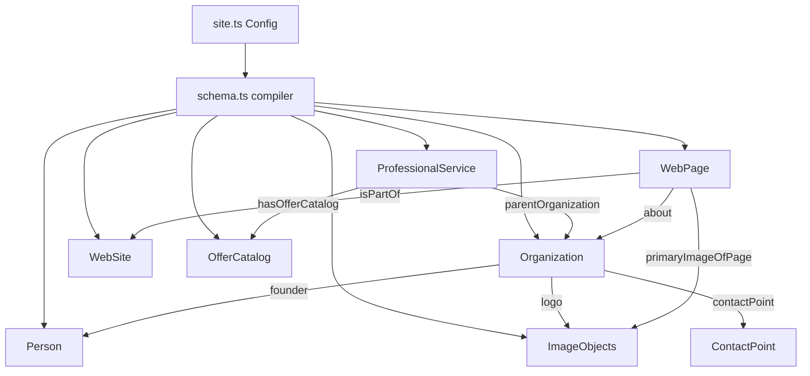

# 🎯 Schema.org Structured Data & Centralized Deployment Framework
## DK Digital Studio Standard Engineering Handbook

This framework serves as DK Digital Studio's standard technical package for current and future client projects. It implements a production-grade, environment-aware metadata pipeline and modular Schema.org structured JSON-LD graphs.

---

## 🗂️ 1. Folder Structure

The environment, metadata, and schema assets are organized as follows:

```
portfolio/
 ├── .env.development       # 🛠️ Development Environment Variable
 ├── .env.production        # 🚀 Production Default Environment Variable
 ├── package.json           # 📦 App build scripts (generate-assets hook)
 ├── vite.config.ts         # ⚙️ Vite dynamic define bundler mapping
 ├── public/                # 🖼️ Static branding assets
 │    ├── logo.png          # High-resolution brand logo (512x512)
 │    ├── favicon.ico       # browser tab favicon
 │    ├── apple-touch-icon.png # iOS bookmark icon (180x180)
 │    └── og-image.jpg      # WhatsApp/LinkedIn Preview Image (1200x630)
 ├── scripts/
 │    └── generate-assets.js # ⚡ Dynamic Post-Build asset compiler
 ├── src/
 │    ├── config/
 │    │    └── site.ts       # ⚙️ Central Business & Branding Configuration
 │    ├── seo/
 │    │    ├── schema.ts         # 🔗 Core Linker Graph Compiler
 │    │    ├── organization.ts   # 🏢 Organization Schema Entity
 │    │    ├── person.ts         # 👩 Person (Founder & Occupation) Schema Entity
 │    │    ├── professionalService.ts # 🛠️ ProfessionalService Schema Entity
 │    │    ├── website.ts        # 🌐 WebSite Schema Entity
 │    │    ├── webpage.ts        # 📄 WebPage (Homepage context) Schema Entity
 │    │    ├── imageObject.ts    # 🖼️ ImageObject (Logo, OG, Portrait) Schema Entity
 │    │    ├── contactPoint.ts   # 📞 ContactPoint Schema Entity
 │    │    └── offerCatalog.ts   # 💼 OfferCatalog (Services Catalog) Schema Entity
 │    └── components/
 │         └── SchemaMarkup.tsx  # ⚛️ React Component Injector
```

---

## 🔄 2. Architecture & The Schema Graph Model

This framework compiles all entities into a single **Linked Graph** array (`@graph`) wrapped in a single JSON-LD block to satisfy Rich Results requirements and prevent data duplication:



---

## ⚙️ 3. Environment & Deployment Architecture

The framework is completely environment-aware, resolving URLs at compile and build phases depending on where the app is executed.

### A. Local Development
* **Configuration**: Defined inside `.env.development`.
* **VITE_SITE_URL**: `http://localhost:5173`
* **Behavior**: Serves local files. Browser metadata automatically points to `localhost`.

### B. Vercel Preview Deployments
* **Configuration**: Vercel system environment variables are used. The Vite configuration maps Vercel's host variables automatically.
* **Exposition**: Exposes Vercel's dynamic preview URL (`process.env.VERCEL_URL`) at compile-time.
* **Behavior**: Previews and metadata automatically update to match the dynamic Vercel branch preview domain (e.g., `https://estique-designs-portfolio-git-main.vercel.app/`).

### C. Vercel Production
* **Configuration**: Defaults to `.env.production` value unless overridden in Vercel.
* **VITE_SITE_URL**: Configured as `https://estique-designs-portfolio.vercel.app` (until custom domain `estiquedesigns.com` is connected).
* **Behavior**: Generates official search links.

### D. Dynamic Asset Compiler (`generate-assets.js`)
Since search engine sitemaps, crawlers, and webmanifests are static files inside `public/`, we write them dynamically at build time:
1. **Compilation Step**: When Vercel runs `npm run build`, the post-build hook triggers `node scripts/generate-assets.js`.
2. **Dynamic Generation**: The script reads the active environment URL (e.g. preview URL or production domain) and writes custom sitemaps, robots.txt, and site.webmanifest parameters directly into `dist/`.
3. **HTML Metadata Injection**: The script automatically parses the built `dist/index.html` and replaces the placeholder URLs with the active URL, ensuring canonical/OG preview consistency across all branches.

---

## 🖼️ 4. Branding Assets Architecture

### Standard Asset Convention
All assets must be saved inside `public/` using the following exact file names:
* `public/og-image.jpg` — Open Graph preview image (1200 x 630px, 1.91:1 ratio).
* `public/logo.png` — Standard high-resolution brand logo (512 x 512px).
* `public/apple-touch-icon.png` — Apple bookmark icon (180 x 180px).
* `public/favicon.ico` — Falling browser tab icon.

### Centralized Reference Mapping
Every page meta tag, Open Graph, and JSON-LD schema builder references these images dynamically from the `siteConfig` object inside [src/config/site.ts](file:///c:/Users/InfinityMFB/Documents/PORTFOLIO/src/config/site.ts):

```typescript
export const siteConfig = {
  siteUrl: baseUrl,
  logo: `${baseUrl}/logo.png`,
  favicon: `${baseUrl}/favicon.ico`,
  appleTouchIcon: `${baseUrl}/apple-touch-icon.png`,
  ogImage: `${baseUrl}/og-image.jpg`,
  twitterImage: `${baseUrl}/og-image.jpg`,
  organizationImage: `${baseUrl}/logo.png`,
  // ...
};
```

---

## 🚀 5. How to Deploy on a New Client Website

To reuse this architecture for another DK Digital Studio client (e.g. DamiGlow):

1. **Replace Assets**: Add the new client assets to the `public/` directory keeping the exact naming convention:
   * `og-image.jpg`
   * `logo.png`
   * `apple-touch-icon.png`
   * `favicon.ico`
2. **Update site.ts Config**: Open [src/config/site.ts](file:///c:/Users/InfinityMFB/Documents/PORTFOLIO/src/config/site.ts) and edit the business variables (services, founder, address, contact, socials).
3. **Update VITE_SITE_URL**: Open `.env.production` (or Vercel Dashboard envs) and update `VITE_SITE_URL` to point to the client's custom domain (e.g. `https://damiglow.com`).

---

## 🛠️ 6. How to Add Additional Schema Entities Later

To add a new Schema type (e.g. `FAQPage`):
1. **Create Entity Builder**: Write a helper module in `src/seo/` (e.g., `src/seo/faq.ts`) that takes `SiteConfig` as a type-parameter and builds the JSON structure.
2. **Append to Graph Compiler**: Import and append the new entity into the `@graph` array inside [src/seo/schema.ts](file:///c:/Users/InfinityMFB/Documents/PORTFOLIO/src/seo/schema.ts).

---

## 📋 7. DK Digital Studio Engineering Checklists

### 🚀 A. Deployment Checklist
* [ ] Verify `.env.development` has `VITE_SITE_URL=http://localhost:5173`.
* [ ] Verify `.env.production` is set to the current production domain.
* [ ] Confirm Vercel Dashboard environment configurations do not override variables incorrectly.
* [ ] Verify that `npm run build` completes with zero errors and logs `✓ Production index.html updated dynamically`.

### 🔍 B. SEO & Meta Checklist
* [ ] Page Title is under 60 characters and targets primary keywords.
* [ ] Meta Description is under 160 characters and avoids keyword stuffing.
* [ ] Canonical link tag points to the absolute environment URL.
* [ ] Robots.txt allows crawling and points to the sitemap location.
* [ ] Sitemap.xml renders valid XML referencing the active domain.

### 🖼️ C. Open Graph & Social Checklist
* [ ] Preview image `og-image.jpg` is exactly 1200 x 630px.
* [ ] Test WhatsApp preview layout: checks `og:title`, `og:description`, and absolute image path.
* [ ] Test Twitter Cards: verifies `twitter:card = summary_large_image`.
* [ ] Verify Slack/Discord preview: confirms absolute URL images do not yield 404 errors.

### 🏢 D. Schema.org Validation Checklist
* [ ] Run markup code through the [Google Rich Results Test](https://search.google.com/test/rich-results).
* [ ] Run graph code through the [Schema Markup Validator](https://validator.schema.org) to check for missing parameters.
* [ ] Ensure founder `@id` references link the Organization and Person profiles correctly.
